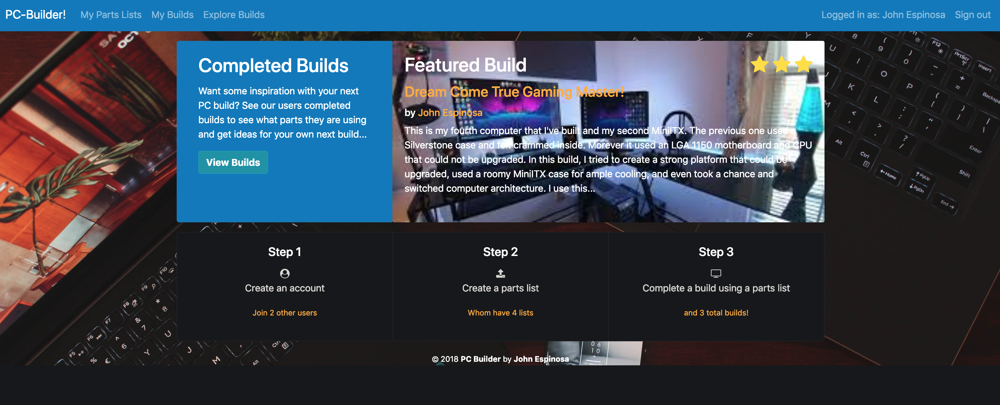

# Rails Portfolio Project
## PC Builder

### [Demo](https://jespnpcbuilderapp.herokuapp.com/)

  John Espinosa for Learn.co Fullstack Web Development Course
  

  Create and plan computer builds with your own parts lists
  

### Install Instructions
  To begin using this application
  - clone into local repository
  - run `bundle install`
  - `rake db:create`
  - `rake db:migrate`
  - `rails s` to start local server
  - in browser visit http://localhost:3000/
  - signup can be achieved through facebook, or new account creation

### Purpose
  This Rails application allows users to plan and create new computer builds. A user can create parts lists, which then allows them to create builds using those parts lists. A user can add images to their builds. There is support for liking and commenting on other users builds. A user can explore all the builds on the site and they can be sorted by newest, oldest, or most liked. 

### Contributing
#### Report bugs using Github's [issues](https://github.com/johnfelixespinosa/pc_builder/issues)
  Use GitHub issues to track public bugs. Report a bug by [opening a new issue](https://github.com/johnfelixespinosa/pc_builder/issues/new); it's that easy!

### License
  This project is being created open source under the terms of the [MIT License](http://opensource.org/licenses/MIT).  
  Background image photo by [Ami Nair](https://unsplash.com/@a_myth) on [Unsplash](https://unsplash.com)

### Author
  [John Espinosa](http://johnfelixespinosa.github.io/)
